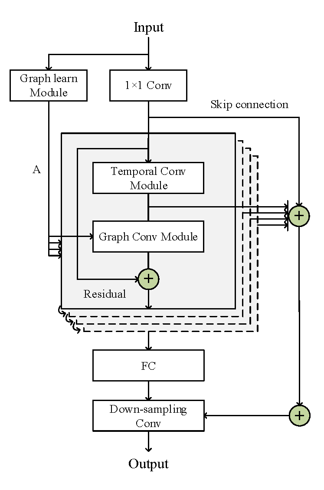

# MDST-GNN
 a multivariate time series deep spatiotemporal forecasting model with graph neural network (MDST-GNN) is proposed to solve the existing shortcomings and improve the accuracy of periodic data prediction in this paper.
 
 This is a PyTorch implementation of the paper: [Multivariate Time Series Deep Spatiotemporal Forecasting with Graph Neural Network](https://doi.org/10.3390/app12115731), published in Applied Sciences.

**Figure 1  Model structure diagram of MDST-GNN.**
# Data
The multivariate time series dataset Solar-Energy, Traffic, Electricity, Exchange-rate datasets can be found in the data file.

# Requirements
The model is implemented using Python with dependencies specified in requirements.txt
